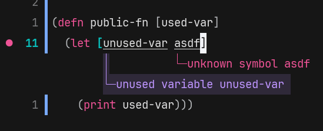

A simple [janet](https://github.com/janet-lang/janet) language server, specificly built for [helix](https://github.com/helix-editor/helix).

[janet-lsp](https://github.com/CFiggers/janet-lsp) already exists, but I wanted to make my own just for fun and to learn more about janet. I've also borrowed some code from janet-lsp.

This server was developed for helix and I haven't really tested it with any other editor. I've tested it a little with nvim and it seems to work.

<table>
  <tr>
    <td></td>
    <td></td>
  </tr>
</table>

# Installation

In theory, you should be able to install this using [jpm](https://github.com/janet-lang/jpm) or janet-pm from [spork](https://github.com/janet-lang/spork/), but I couldn't get this to install using any of those for some reason.

After cloning the repo, you should be able to run:

```
jpm deps
jpm install
```

or

```
janet-pm deps
janet-pm install
```

## Manual installation

In my case, I can't get `jpm` or `janet-pm` to work, so I've manually installed this by creating `janet-lsp.bat` in `AppData\Local\Apps\Janet\Library\bin`. Inside `janet-lsp.bat` is:

```bat
@echo off
goto #_undefined_# 2>NUL || title %COMSPEC% & janet "path-to\simple-janet-lsp\init.janet" %*
```

# Helix configuration

To use with helix, add to your `language.toml` file:

```toml
[language-server]
janet-lsp = { command = "janet-lsp", args = [""] }

[[language]]
name = "janet"
language-servers = ["janet-lsp"]
# If you have `spork` installed, you can add:
# auto-format = true
```
